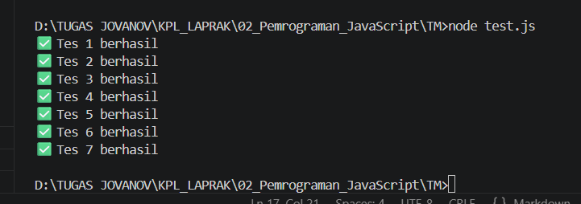

# Tugas Mandiri: Pemrograman JavaScript

NAMA : Jovanov Alvin Bertram
NIM : 103122400045
SE-08-02

## Soal

Buatlah sebuah fungsi bernama fizzBuzz yang menerima input larik (array) dan mengembalikan deretan bilangan dan "Fizz" untuk kelipatan 2, "Buzz" untuk kelipatan 7, dan "FizzBuzz" untuk kelipatan 14.

## Kode Sumber

Tersedia di test.js dan tm.js

## Output

## Deskripsi

Program dibuat menggunakan fungsi fizzBuzz yang menerima input berupa array. Program akan mengecek setiap elemen array satu per satu.

Jika angka merupakan kelipatan 14 maka akan menghasilkan "FizzBuzz". Jika angka merupakan kelipatan 7 maka menghasilkan "Buzz". Jika angka merupakan kelipatan 2 maka menghasilkan "Fizz". Selain itu angka akan ditampilkan seperti biasa.

Program juga melakukan validasi input. Jika input bukan array maka fungsi akan mengembalikan pesan "Input tidak valid".

Hasil pengujian menunjukkan seluruh test berhasil dijalankan dengan sukses.