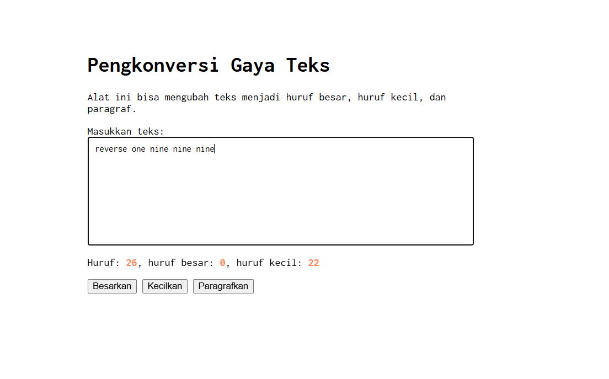
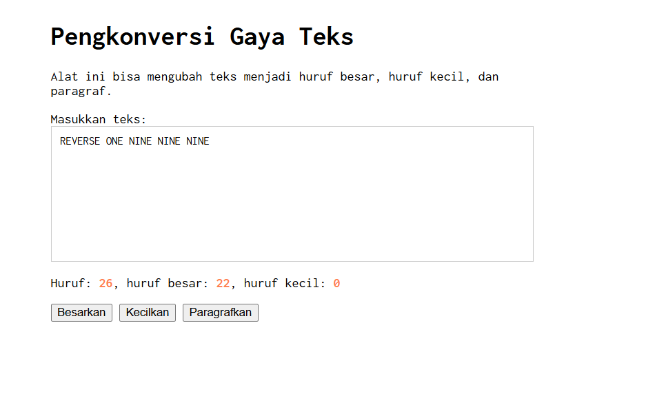
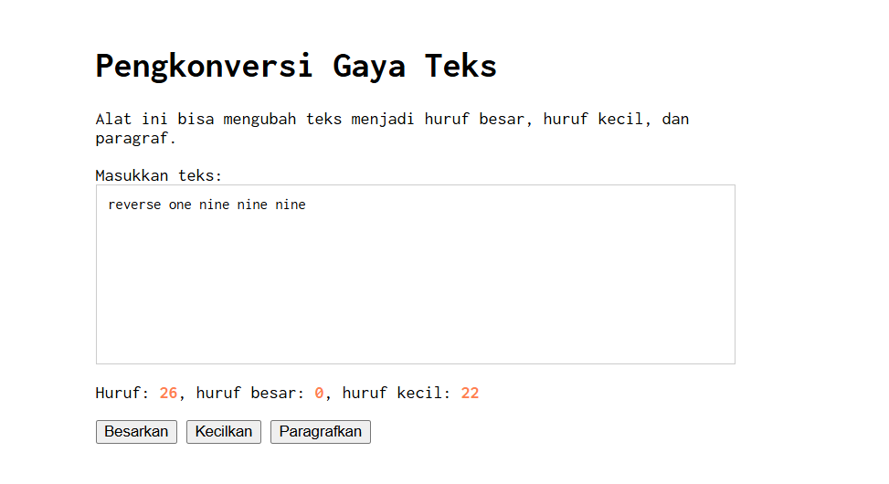

# Tugas Modul 3
NAMA : Jovanov Alvin Bertram
NIM : 103122400045
CLASS : SE-08-02

## Soal

Buatlah tata letak laman yang berada di tengah halaman dan gunakan font Inconsolata dari Google Fonts. Tambahkan fitur untuk menghitung jumlah huruf, huruf besar, huruf kecil, serta mengubah teks menjadi huruf besar, huruf kecil, dan paragraf.

---

## Kode Sumber

Tersedia pada file:

- index.html
- index.css
- index.js

---

## Output

### Menghitung Huruf

### Besarkan Huruf

### Kecilkan Huruf

---

## Deskripsi

Program ini dibuat menggunakan HTML, CSS, dan JavaScript.

HTML digunakan untuk membuat struktur halaman yang terdiri dari textarea, informasi jumlah karakter, dan tombol aksi.

CSS digunakan untuk mengatur tampilan halaman agar berada di tengah layar serta menggunakan font Inconsolata dari Google Fonts sesuai dengan instruksi tugas.

JavaScript digunakan untuk menghitung jumlah huruf, jumlah huruf besar, dan jumlah huruf kecil secara otomatis ketika pengguna mengetik. Selain itu JavaScript juga digunakan untuk mengubah teks menjadi huruf besar, huruf kecil, dan format paragraf melalui tombol yang tersedia.