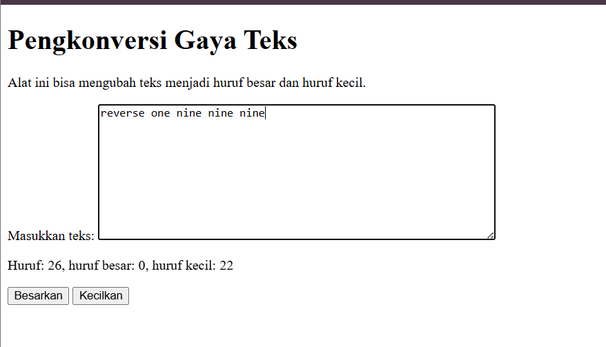
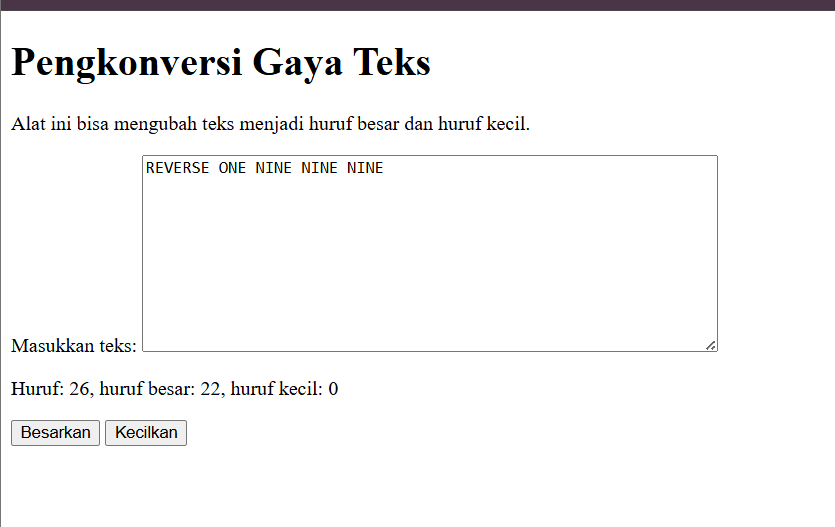
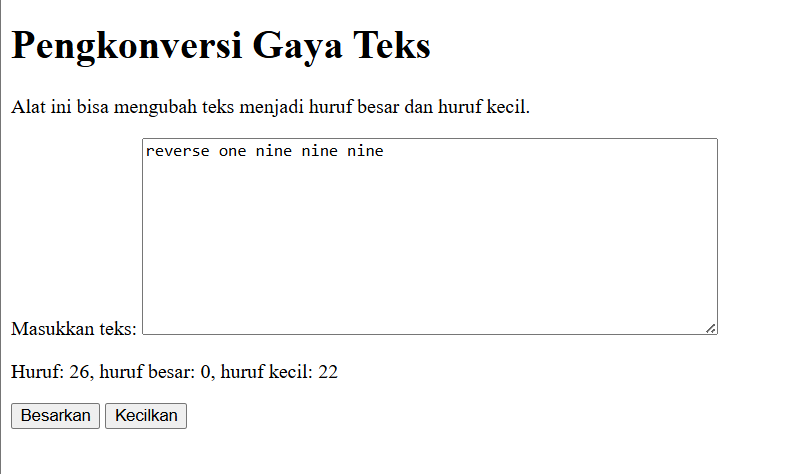

# Tugas Praktikum 03
NAMA : Jovanov Alvin Bertram
NIM : 103122400045
CLASS : SE-08-02

## Output

### Hitung Huruf Kecil

### Besarkan Huruf

### Kecilkan Huruf

## Deskripsi

Program ini dapat menghitung jumlah huruf kecil, mengubah seluruh teks menjadi huruf besar, dan mengubah seluruh teks menjadi huruf kecil menggunakan JavaScript. Jumlah huruf besar, huruf kecil, dan total karakter akan diperbarui secara otomatis saat pengguna mengetik.