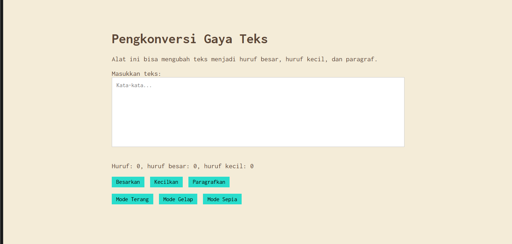

# Tugas Praktikum 04

NAMA : Jovanov Alvin Bertram

NIM : 103122400045

CLASS : SE-08-02

---

## Output

### Mode Sepia

![Output]

---

## Penjelasan

Pada tugas ini ditambahkan fitur **Mode Sepia** pada aplikasi Pengkonversi Gaya Teks. Mode Sepia menggunakan warna latar belakang `#F4ECD8` dan warna teks `#5B4636` sesuai ketentuan tugas.

Implementasi dilakukan dengan:

* Menambahkan tombol **Mode Sepia** pada bagian mode.
* Menambahkan class CSS `.sepia-mode`.
* Menggunakan JavaScript untuk mengganti state tampilan antara:

  * `light-mode`
  * `dark-mode`
  * `sepia-mode`

Textarea tetap menggunakan warna putih sesuai ketentuan tugas mandiri.

Fitur lain seperti menghitung jumlah huruf, mengubah huruf menjadi besar, kecil, dan paragraf tetap berjalan dengan baik pada semua mode tampilan.
