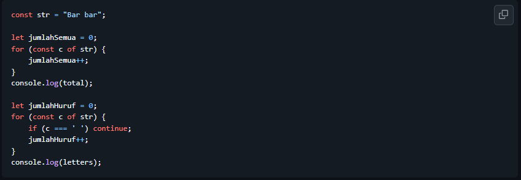
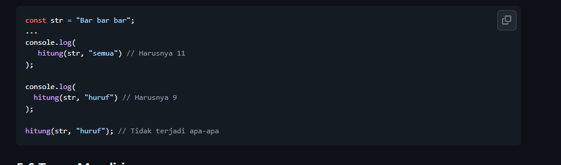

# Tugas Praktikum 05

NAMA : Jovanov Alvin Bertram

NIM : 103122400045

CLASS : SE-08-02

## Soal

## Kode Sumber

Tersedia di [hitung.js](hitung.js)

## Output

## Deskripsi

Program menggunakan satu fungsi generik bernama `hitung()` untuk menghitung jumlah karakter pada sebuah string. Parameter `tipe` digunakan untuk menentukan jenis perhitungan yang dilakukan.

Jika nilai `tipe` adalah `"semua"`, maka seluruh karakter termasuk spasi akan dihitung. Jika nilai `tipe` adalah `"huruf"`, maka hanya karakter selain spasi yang dihitung.

Dengan pendekatan ini, satu fungsi dapat digunakan kembali untuk beberapa kebutuhan perhitungan tanpa membuat fungsi yang berbeda.