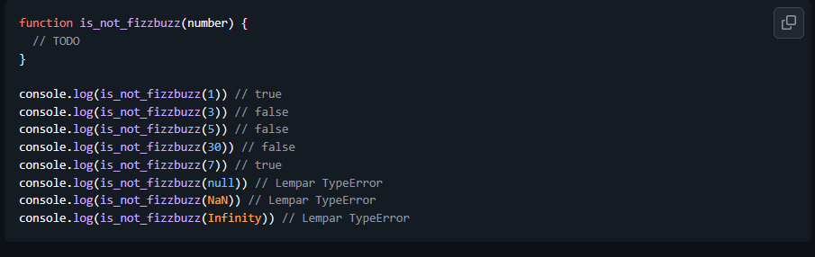
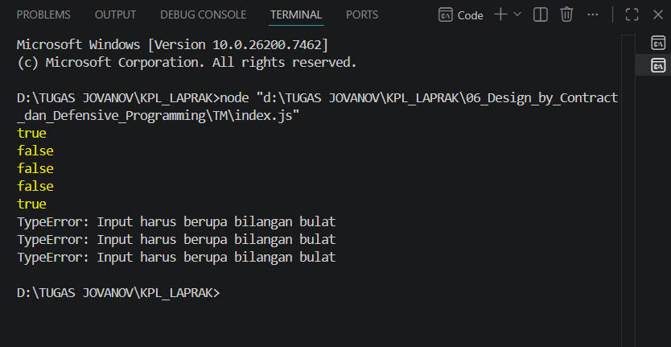

# Tugas Mandiri 06

NAMA : Jovanov Alvin Bertram

NIM : 103122400045

CLASS : SE-08-02

## Soal

## Kode Sumber

Tersedia di [index.js](index.js)

## Output

## Deskripsi

Fungsi `is_not_fizzbuzz()` digunakan untuk memeriksa apakah suatu bilangan bukan termasuk bilangan fizzbuzz. Program akan mengembalikan nilai `false` apabila bilangan merupakan kelipatan 3 atau 5, dan mengembalikan nilai `true` apabila bukan kelipatan keduanya.

Selain itu, program menerapkan konsep Defensive Programming dengan melakukan validasi menggunakan `Number.isInteger()`. Jika input bukan bilangan bulat seperti `null`, `NaN`, atau `Infinity`, maka program akan melempar `TypeError` sehingga kesalahan dapat ditangani dengan baik dan program menjadi lebih aman.