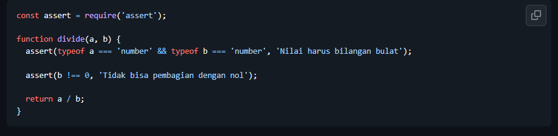
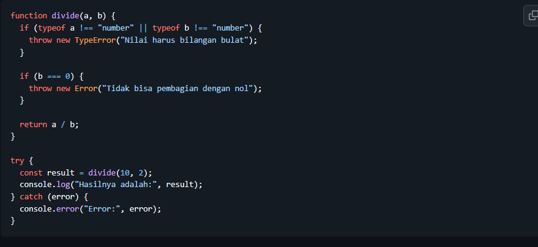
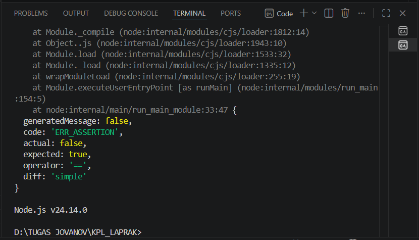
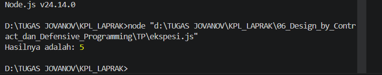

# Tugas Pendahuluan 06

NAMA : Jovanov Alvin Bertram

NIM : 103122400045

CLASS : SE-08-02

## Soal

### Soal 1

### Soal 2

## Kode Sumber

Tersedia di [asersi.js](asersi.js) dan [ekspesi.js](ekspesi.js)

## Output

### Asersi

### Ekspesi

## Deskripsi

Pada program pertama digunakan konsep Design by Contract dengan memanfaatkan modul `assert`. Assert digunakan untuk memastikan bahwa parameter yang diberikan berupa angka dan pembagi tidak bernilai nol. Jika syarat tersebut tidak terpenuhi maka program akan langsung menghasilkan AssertionError.

Pada program kedua digunakan konsep Defensive Programming dengan mekanisme exception menggunakan `throw`, `try`, dan `catch`. Program akan melempar TypeError apabila input bukan angka dan Error apabila terjadi pembagian dengan nol. Kesalahan tersebut kemudian dapat ditangani dengan baik melalui blok catch sehingga program lebih aman dan mudah dipelihara.

Kedua pendekatan memiliki tujuan yang sama yaitu mencegah kesalahan, namun digunakan pada kondisi yang berbeda. Assert lebih cocok digunakan untuk memverifikasi asumsi internal program, sedangkan exception lebih cocok digunakan untuk menangani kesalahan yang mungkin berasal dari pengguna atau lingkungan eksternal.