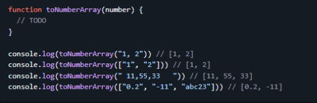
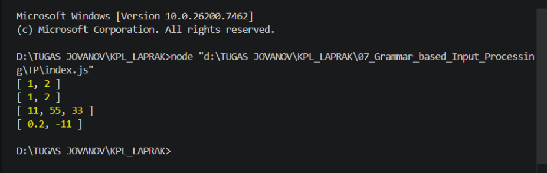

# Tugas Pendahuluan: Grammar Based Input Processing

Nama : Jovanov Alvin Bertram
NIM : 103122400045
Kelas : SE-08-02

## Soal

## Kode Sumber
Tersedia di index.js, test.js, dan structure.d.ts

## Output

## Deskripsi
Pada tugas ini dibuat sebuah fungsi `parseRobots()` yang bertujuan untuk memproses isi file `robots.txt` menjadi sebuah objek JavaScript yang lebih terstruktur. Fungsi membaca setiap baris pada file robots.txt kemudian mengidentifikasi informasi penting seperti `User-agent`, `Allow`, `Disallow`, dan `Sitemap`.

Proses parsing dilakukan dengan memecah setiap baris berdasarkan karakter titik dua (`:`) untuk mendapatkan pasangan key dan value. Ketika ditemukan `User-agent`, program akan membuat objek baru pada properti `agents`. Selanjutnya aturan `Allow` dan `Disallow` akan dimasukkan ke dalam user-agent yang sedang aktif. Informasi `Sitemap` disimpan ke dalam array sehingga dapat menampung lebih dari satu alamat sitemap apabila diperlukan.

Implementasi ini memungkinkan file robots.txt dari berbagai website diproses ke dalam format data yang konsisten dan mudah digunakan oleh program lain. Untuk memastikan fungsi berjalan dengan benar, dilakukan pengujian menggunakan `test.js` terhadap beberapa file robots.txt dari website Brave, MikroTik, OpenAI, Lazada, dan Kementerian Agama Republik Indonesia.

Hasil pengujian menunjukkan seluruh pengujian berhasil dijalankan dengan hasil `25 tests passed` dan `0 failed`. Dengan demikian dapat disimpulkan bahwa fungsi `parseRobots()` telah bekerja sesuai kebutuhan dan mampu memproses berbagai variasi format robots.txt dengan benar.
