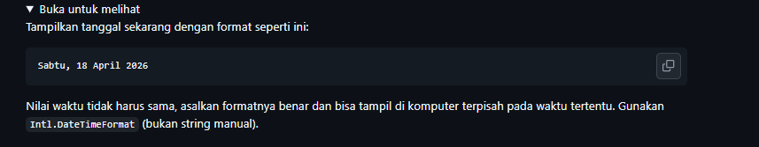

# Tugas Pendahuluan 08

Nama : Jovanov Alvin Bertram
NIM : 103122400045
Kelas : SE-08-02

## Soal

## Kode Sumber
di file index.js

## Output

## Deskripsi
Program menampilkan tanggal saat ini menggunakan objek Date dan Intl.DateTimeFormat dengan locale Indonesia (id-ID). Format yang ditampilkan meliputi nama hari, tanggal, bulan, dan tahun sesuai standar penulisan tanggal Indonesia.