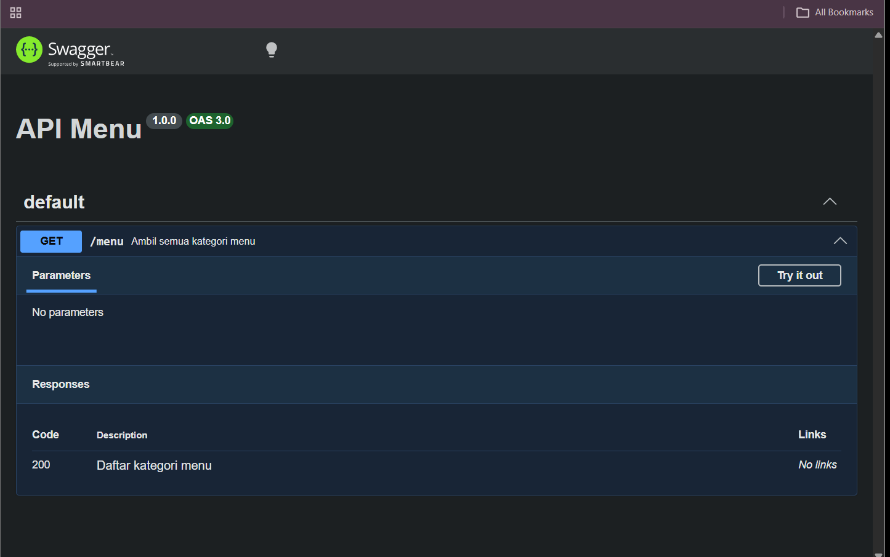

# Tugas Pendahuluan 09

## Nama

Jovanov Alvin Bertram

## NIM

103122400045

## Modul

09 - API Design dan Construction Using Swagger

## Tujuan

Membuat endpoint API menggunakan Express.js dan mendokumentasikannya menggunakan Swagger UI.

## Kode Sumber

File: `index.js`

## Output

### Dokumentasi Swagger

### Hasil Endpoint GET /menu

![Endpoint]

## Deskripsi

Program dibuat menggunakan Express.js dan Swagger UI Express. Endpoint `GET /menu` digunakan untuk menampilkan daftar kategori menu yang tersedia dalam format JSON.

Dokumentasi API dapat diakses melalui endpoint `/docs`, sehingga pengguna dapat melihat informasi endpoint, metode HTTP yang digunakan, deskripsi endpoint, serta respons yang dihasilkan.

Ketika endpoint `/menu` diakses, server akan mengembalikan data kategori menu yang telah disediakan dalam bentuk JSON. Implementasi ini menunjukkan penggunaan dasar Swagger sebagai alat dokumentasi API pada aplikasi Node.js.
