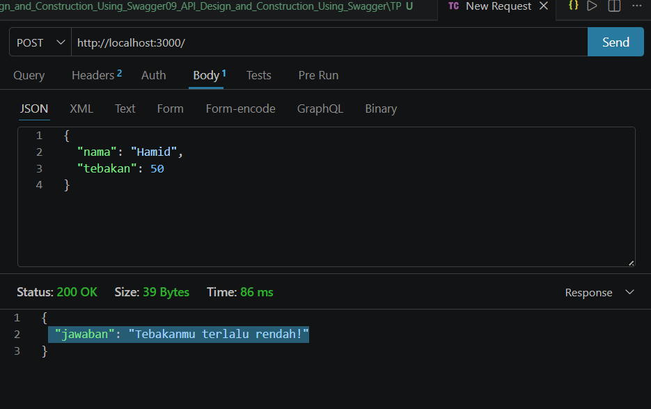

# TP 09 - API Design and Construction Using Swagger

## Deskripsi
Membuat API permainan tebak angka menggunakan Express.js.

## Endpoint

### POST /

Request

```json
{
  "nama": "Hamid",
  "tebakan": 50
}
```

Response

```json
{
  "jawaban": "Tebakanmu terlalu rendah!"
}
```

## Screenshot Hasil

