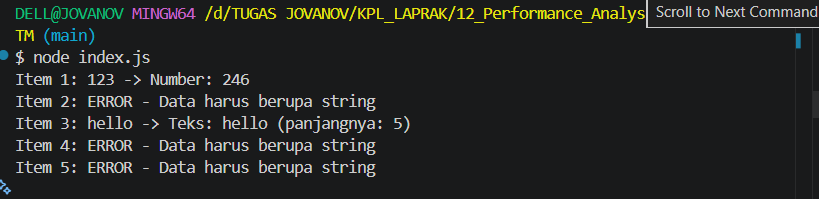

# TM12 - Performance Analysis dan Unit Testing

## Analisis

Kode awal memiliki kecacatan karena fungsi `processData()` selalu memanggil method `toLowerCase()`, padahal method tersebut hanya dapat digunakan pada tipe data string.

Akibatnya, program akan mengalami error ketika menerima data berupa angka (`456`, `78.9`) maupun boolean (`true`).

Perbaikan dilakukan dengan menambahkan validasi tipe data menggunakan `typeof` serta menangani kesalahan menggunakan `try...catch` sehingga program tetap berjalan meskipun terdapat data yang tidak sesuai.

## Output

