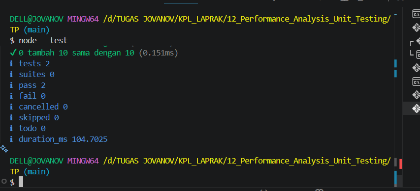

# TP12 - Performance Analysis dan Unit Testing

## Source Code

### hitung.js

```javascript
function tambahPengitung(terkini, jumlah) {
    terkini = terkini + jumlah;
    return terkini;
}

export { tambahPengitung };
```

### hitung.test.js

```javascript
import { test } from "node:test";
import assert from "node:assert";
import { tambahPengitung } from "./hitung.js";

test("5 tambah 3 sama dengan 8", () => {
    assert.strictEqual(tambahPengitung(5, 3), 8);
});

test("0 tambah 10 sama dengan 10", () => {
    assert.strictEqual(tambahPengitung(0, 10), 10);
});
```

## Hasil Pengujian

Pengujian dilakukan menggunakan Node.js Test Runner (`node --test`).

Hasil pengujian menunjukkan bahwa seluruh test berhasil dijalankan tanpa error dengan nilai:

* Tests: 2
* Pass: 2
* Fail: 0

## Output


